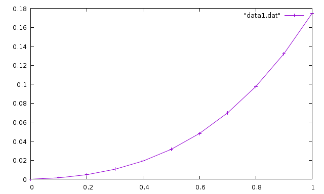
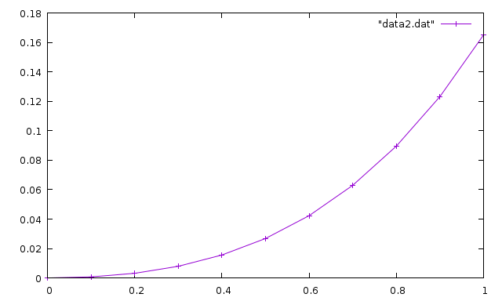

Вариант 13
-----
Для решения данных задач использовалься язык программирования C++.  
Внизу я подробно расписал решение. Файл с программой C++ указан в начале каждого задания

Графики делал в Wolfram Alpha (она же и считала производные, так как я в математике нуль).

-----
## 1. Численное дифференцирование
**Программа:** lesson1.cpp

### Вывод программы
Программа ищет первую и вторую производную в точке x=0 с шагом h = 0.01:
```
Первая производная: -1.37002
Вторая производная: 2.7092
```

### Проверка на максиме
Первая производная
```
at(diff(sqrt(0.4*x + 1.7) / (1.5*x + sqrt(x^2 + 1.3)),x,1),[x=0]);
```
```
-1.369896765478271
```
Вторая производная
```
at(diff(sqrt(0.4*x + 1.7) / (1.5*x + sqrt(x^2 + 1.3)),x,2),[x=0]);
```
```
2.708960197900711
```

### Результаты
| x               | dy/dx | d^2y/dx^2 | dy/dx Maxima | d^2/dx^2 Maxima |
| :-------------  | :------------- | :------------- | :------------- | :------------- |
| 0               | -1.37002       | 2.7092 | -1.369896765478271 | 2.708960197900711 |

-----
## 2. Численное интегрирование
**Программа:** lesson2.cpp

### Вывод программы
Интеграл считался в промежутке от 1.2 до 2.6. Используется 15 точек интегрирования.
```
Формула средних прямоугольников: 0.445539
Формула трапеций: 0.445719
Формула Симпсона: 0.445599
```
### Проверка на максиме
```
quad_qags(sqrt(0.4*x + 1.7) / (1.5*x + sqrt(x^2 + 1.3)), x, 1.2, 2.6);
```
```
[0.4455986699544126,4.94713903125735*10^-15,21,0]
```

### Результаты
| Число точек интегр. | Метод прямоугольников | Метод трапеций | Метод Симпсона | Maxima             |
| :------------------ | :-------------------- | :------------- | :------------- | :----------------- |
| 15                  | 0.445539              | 0.445719       | 0.445599       | 0.4455986699544126 |

---

## 3. Методы решения нелинейных алгебраических уравнений
**Программа:** lesson3.cpp

### Отделение корней графическим методом

Для решения данной задачи нам необходимо привести наше уравнение к виду x=f(x):  


Теперь нам надо построить график функции и найти пересечение с осью X - это и будет наш искомый корень. Так что приводим уравнение к виду f(x)=0:


И теперь построим график функции:  


Как видим, пересечение с осью X у нас находится в пределах от 1 до 2. Так, что возьмём x=1 в качестве начальной точки.

Для решения методом Ньютона нам так же необходимо найти производную нашей функции f(x)=0. Она будет иметь такой вид:  


### Вывод программы
Корень искался от начальной точки x0=1 и с допустимой ошибкой eps=0.0001:
```
Итеративный метод: 1.55711
Метод Ньютона: 1.55715
```

### Проверка на максиме
```
find_root(log(x)-2+x, x, 1, 2);
```
```
1.557145598997611
```

### Результаты
| Метод итерации | Метод Ньютона | Точность | Maxima |
| :-------- | :------- | :-------- | :--------- |
| 1.55711 | 1.55715 | 0.0001 | 1.557145598997611 |


## 4. Приближённые методы решения обыкновенных дифференциальных уравнений
**Программа:** lesson4.cpp

### Вывод программы
Вывод функций с начальным условием y(0)=0 и шагом h=0.1:
```
Метод Эйлера
0: 0
0.1: 0.00142065
0.2: 0.00473524
0.3: 0.0104641
0.4: 0.0191803
0.5: 0.0315157
0.6: 0.0481682
0.7: 0.0699098
0.8: 0.0975949
0.9: 0.132171
1: 0.17469

Метод Рунге-Кутты
0: 0
0.1: 0.000711135
0.2: 0.00317751
0.3: 0.00793819
0.4: 0.0155903
0.5: 0.0267964
0.6: 0.0422926
0.7: 0.0628981
0.8: 0.0895256
0.9: 0.123193
1: 0.165038
```

### Проверка на Mathematica
Я не стал для этого задания использовать Maxima, потому что так и не разобрался как там решать дифференциальные уравнения и поэтому использовал математический пакет Wolfram Mathematica. Пакет платный, так что можете сказать что обратились к богатому знакомому, который вам посчитал.

И так решаем ДУ с начальным условие y(0)=0:
```
solution = DSolve[{y'[x] == 0.158 (x^2 + Sin[0.8 x]) + 1.164 y[x], y[0] == 0}, y[x], x]
```
```
{{y[x] ->
   0.26373 (-0.759747 + 1. E^(1.164 x) - 0.884346 x - 0.514689 x^2 -
      0.240253 Cos[0.8 x] - 0.349567 Sin[0.8 x])}}
```
Теперь нам необходимо использовать решение в качестве функции:
```
f[x_] = y[x] /. solution[[1]]
```
```
0.26373 (-0.759747 + 1. E^(1.164 x) - 0.884346 x - 0.514689 x^2 -
   0.240253 Cos[0.8 x] - 0.349567 Sin[0.8 x])
```
Теперь подставляем туда аргумент x=1, и получаем ответ:
```
f[1]
```
```
0.165038
```

### Результаты
| Метод Эйлера     | Метод Рунге-Кутты     | Mathematica/Maxima |
| :-------------   | :-------------        | :-----------       |
| 0.17469          | 0.165038              | 0.165038           |

#### Графики
Так же, судя по заданию, нужно прикрепить графики функций.

Метод Эйлера:



Метод Рунге-Кутты:



---

## 5. Квадратура круга методом Монте-Карло
**Программа:** lesson5.cpp

### Вывод программы
Провели 100 000 испытаний:
```
Число Пи: 3.14248
```
