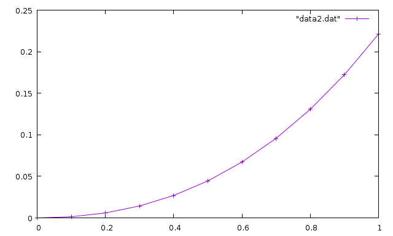

Вариант 15
-----
Для решения данных задач использовалься язык программирования C++.  
Внизу я подробно расписал решение. Файл с программой C++ указан в начале каждого задания

Графики делал в Wolfram Alpha (она же и считала производные, так как я в математике нуль).

-----
## 1. Численное дифференцирование
**Программа:** lesson1.cpp

### Вывод программы
Программа ищет первую и вторую производную в точке x=0 с шагом h = 0.01:
```
p1: -0.127641
p2: 0.210168
```

### Проверка на максиме
Первая производная
```
at(diff(sqrt(0.3*x^2+2.3)/(1.8+sqrt(2*x+1.6)),x,1),[x=0]);
```
```
-0.1276345268780763
```
Вторая производная
```
at(diff(sqrt(0.3*x^2+2.3)/(1.8+sqrt(2*x+1.6)),x,2),[x=0]);
```
```
0.2101577602259403
```

### Результаты
| x          | dy/dx | d^2y/dx^2 | dy/dx Maxima | d^2/dx^2 Maxima |
| :--------  | :------------- | :------------- | :------------- | :------------- |
| 0          | -0.127641       | 0.210168 | -0.1276345268780763 | 0.2101577602259403 |

-----

## 2. Численное интегрирование
**Программа:** lesson2.cpp

### Вывод программы
Интеграл считался в промежутке от 0.8 до 1.6. Используется 15 точек интегрирования.
```
Первый метод: 0.349139
Второй метод: 0.349155
Третий метод: 0.349145
```
### Проверка на максиме
```
quad_qags(sqrt(0.3 * x^2 + 2.3) / (1.8 + sqrt(2*x + 1.6)),x,0.8,1.6);
```
```
[0.3491446395359825,3.876284177372987*10^-15,21,0]
```

### Результаты
| Число точек интегр. | Метод прямоугольников | Метод трапеций | Метод Симпсона | Maxima             |
| :------------------ | :-------------------- | :------------- | :------------- | :----------------- |
| 15                  | 0.349139              | 0.349155       | 0.349145       | 0.3491446395359825 |

---

## 3. Методы решения нелинейных алгебраических уравнений
**Программа:** lesson3.cpp

### Отделение корней графическим методом

Для решения данной задачи нам необходимо привести наше уравнение к виду x=f(x):  


Теперь нам надо построить график функции и найти пересечение с осью X - это и будет наш искомый корень. Так что приводим уравнение к виду f(x)=0:


И теперь построим график функции:  


Как видим, пересечение с осью X у нас находится в пределах от 0 до 1. Так, что возьмём x=0 в качестве начальной точки.

Для решения методом Ньютона нам так же необходимо найти производную нашей функции f(x)=0. Она будет иметь такой вид:  


### Вывод программы
Корень искался от начальной точки x0=0 и с допустимой ошибкой eps=0.0001:
```
Первый метод: 0.213311
Второй метод: 0.213309
```

### Проверка на максиме
```
find_root(2*(x-1)^2-exp(x),x,0,1);
```
```
0.2133086343467352
```

### Результаты
| Метод итерации | Метод Ньютона | Точность | Maxima |
| :-------- | :------- | :-------- | :--------- |
| 0.213311 | 0.213309 | 0.0001 | 0.2133086343467352 |

---

## 4. Приближённые методы решения обыкновенных дифференциальных уравнений
**Программа:** lesson4.cpp

### Вывод программы
Вывод функций с начальным условием y(0)=0 и шагом h=0.1:
```
0        0
0.1      0.00286664
0.2      0.00913344
0.3      0.0193205
0.4      0.0339351
0.5      0.0534726
0.6      0.078418
0.7      0.109248
0.8      0.146434
0.9      0.190445
1        0.241752

0        0
0.1      0.00141911
0.2      0.00604453
0.3      0.0144186
0.4      0.027071
0.5      0.0445191
0.6      0.0672701
0.7      0.095822
0.8      0.130667
0.9      0.172293
1        0.22119
```

### Проверка на Mathematica
Я не стал для этого задания использовать Maxima, потому что так и не разобрался как там решать дифференциальные уравнения и поэтому использовал математический пакет Wolfram Mathematica. Пакет платный, так что можете сказать что обратились к богатому знакомому, который вам посчитал.

И так решаем ДУ с начальным условие y(0)=0:
```
solution =
 DSolve[{y'[x] == 0.221 (x^2 + Sin[1.2 x]) + 0.452 y[x], y[0] == 0},
  y[x], x]
```
```
{{y[x] ->
   4.94766 (-0.967402 + 1. E^(0.452 x) - 0.437266 x - 0.098822 x^2 -
      0.032598 Cos[1.2 x] - 0.0122786 Sin[1.2 x])}}
```
Теперь нам необходимо использовать решение в качестве функции:
```
f[x_] = y[x] /. solution[[1]]
```
```
4.94766 (-0.967402 + 1. E^(0.452 x) - 0.437266 x - 0.098822 x^2 -
   0.032598 Cos[1.2 x] - 0.0122786 Sin[1.2 x])
```
Теперь подставляем туда аргумент x=1, и получаем ответ:
```
f[1]
```
```
0.22119
```

### Результаты
| Метод Эйлера     | Метод Рунге-Кутты     | Mathematica/Maxima |
| :-------------   | :-------------        | :-----------       |
| 0.241752 | 0.22119 | 0.22119           |

#### Графики
Так же, судя по заданию, нужно прикрепить графики функций.

Метод Эйлера:


Метод Рунге-Кутты:



---

## 5. Квадратура круга методом Монте-Карло
**Программа:** lesson5.cpp

### Вывод программы
Провели 100 000 испытаний:
```
П: 3.14152
```
