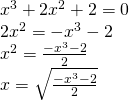
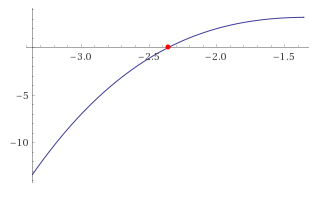
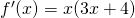
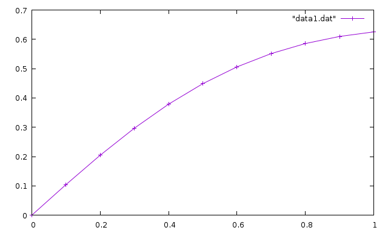
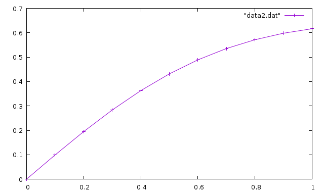

Вариант 2
-----
Для решения данных задач использовалься язык программирования C++.  
Внизу я подробно расписал решение. Файл с программой C++ указан в начале каждого задания

Графики делал в Wolfram Alpha (она же и считала производные, так как я в математике нуль).

-----
## 1. Численное дифференцирование
**Программа:** lesson1.cpp

### Вывод программы
Программа ищет первую и вторую производную в точке x=0 с шагом h = 0.01:
```
0.690904
-0.629871
```

### Проверка на максиме
Первая производная
```
at(diff(sin(2*x+0.5)/(2+cos(x^2.0+1)),x,1),[x=0]);
```
```
0.6909276583839197
```
Вторая производная
```
at(diff(sin(2*x+0.5)/(2+cos(x^2.0+1)),x,2),[x=0]);
```
```
-0.6298794829849888
```

### Результаты
| x               | dy/dx | d^2y/dx^2 | dy/dx Maxima | d^2/dx^2 Maxima |
| :-------------  | :------------- | :------------- | :------------- | :------------- |
| 0               | 0.690904       | -0.629871 | 0.6909276583839197 | -0.6298794829849888 |

-----
## 2. Численное интегрирование
**Программа:** lesson2.cpp

### Вывод программы
Интеграл считался в промежутке от 0.2 до 0.8. Используется 11 точек интегрирования.
```
0.248443
0.248186
0.248357
```
### Проверка на максиме
```
quad_qags(sin(2*x+0.5)/(2+cos(x^2.0+1)), x, 0.2, 0.8);
```
```
[0.2483573238297466,2.757320192500708*10^-15,21,0]
```

### Результаты
| Число точек интегр. | Метод прямоугольников | Метод трапеций | Метод Симпсона | Maxima             |
| :------------------ | :-------------------- | :------------- | :------------- | :----------------- |
| 11                  | 0.248443              | 0.248186       | 0.248357       | 0.2483573238297466 |

---

## 3. Методы решения нелинейных алгебраических уравнений
**Программа:** lesson3.cpp

### Отделение корней графическим методом

Для решения данной задачи нам необходимо привести наше уравнение к виду x=f(x):  



Теперь нам надо построить график функции и найти пересечение с осью X - это и будет наш искомый корень. Уравнение уже в виде f(x)=0, так что ничего с ним делать не надо.
И теперь построим график функции:  



Как видим, пересечение с осью X у нас находится в пределах от -2.5 до -2. Так, что возьмём x=-2.5 в качестве начальной точки.

Для решения методом Ньютона нам так же необходимо найти производную нашей функции f(x)=0. Она будет иметь такой вид:  



### Вывод программы
Корень искался от начальной точки x0=1 и с допустимой ошибкой eps=0.0001:
```
-2.4384
-2.3593
```

### Проверка на максиме
```
find_root(x^3 + 2*x^2 +2, x, -2.5, -2.0);
```
```
-2.359304085971776
```

### Результаты
| Метод итерации | Метод Ньютона | Точность | Maxima |
| :-------- | :------- | :-------- | :--------- |
| -2.4384 | -2.3593 | 0.0001 | -2.359304085971776 |

---

## 4. Приближённые методы решения обыкновенных дифференциальных уравнений
**Программа:** lesson4.cpp

### Вывод программы
Вывод функций с начальным условием y(0)=0 и шагом h=0.1:
```
f(0) = 0
f(0.1) = 0.1045
f(0.2) = 0.204675
f(0.3) = 0.296974
f(0.4) = 0.378805
f(0.5) = 0.448672
f(0.6) = 0.50611
f(0.7) = 0.55147
f(0.8) = 0.585654
f(0.9) = 0.609875
f(1) = 0.625475

f(0) = 0
f(0.1) = 0.0993454
f(0.2) = 0.194918
f(0.3) = 0.283528
f(0.4) = 0.362852
f(0.5) = 0.431509
f(0.6) = 0.488981
f(0.7) = 0.535439
f(0.8) = 0.571536
f(0.9) = 0.598223
f(1) = 0.616593
```

### Результаты
| Метод Эйлера     | Метод Рунге-Кутты     | Mathematica/Maxima |
| :-------------   | :-------------        | :-----------       |
| 0.625475         | 0.616593              | 0.6165932026942526 |

#### Графики
Так же, судя по заданию, нужно прикрепить графики функций.

Метод Эйлера:



Метод Рунге-Кутты:



---

## 5. Квадратура круга методом Монте-Карло
**Программа:** lesson5.cpp

### Вывод программы
Провели 100 000 испытаний:
```
3.14152
```
