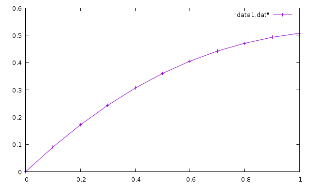
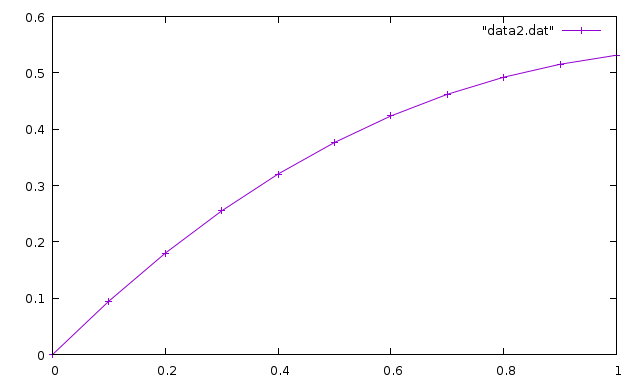

Вариант 3
-----
Для решения данных задач использовалься язык программирования C++.  
Внизу я подробно расписал решение. Файл с программой C++ указан в начале каждого задания

Графики делал в Wolfram Alpha (она же и считала производные, так как я в математике нуль).

-----
## 1. Численное дифференцирование
**Программа:** lesson1.cpp

### Результаты
| x               | dy/dx | d^2y/dx^2 | dy/dx Maxima | d^2/dx^2 Maxima |
| :-------------  | :------------- | :------------- | :------------- | :------------- |
| 0               | 0.0982039       | -0.885155 | 0.09820927516479826 | -0.8852474941938067 |

-----
## 2. Численное интегрирование
**Программа:** lesson2.cpp

### Результаты
| Число точек интегр. | Метод прямоугольников | Метод трапеций | Метод Симпсона | Maxima             |
| :------------------ | :-------------------- | :------------- | :------------- | :----------------- |
| 15                  | 0.53704 | 0.537035 | 0.537038        | 0.5370382279423235 |

---

## 3. Методы решения нелинейных алгебраических уравнений
**Программа:** lesson3.cpp

### Результаты
| Метод итерации | Метод Ньютона | Точность | Maxima |
| :-------- | :------- | :-------- | :--------- |
| 0.641202 | 0.641186 | 0.0001 | 0.641185744504986 |

---

## 4. Приближённые методы решения обыкновенных дифференциальных уравнений
**Программа:** lesson4.cpp

### Результаты
| Метод Эйлера     | Метод Рунге-Кутты     | Mathematica/Maxima |
| :-------------   | :-------------        | :-----------       |
| 0.507639 | 0.531445 | 0.5314452780710012 |

#### Графики
Так же, судя по заданию, нужно прикрепить графики функций.

Метод Эйлера:



Метод Рунге-Кутты:



---

## 5. Квадратура круга методом Монте-Карло
**Программа:** lesson5.cpp

### Вывод программы
Провели 100 000 испытаний:
```
3.14116
```
